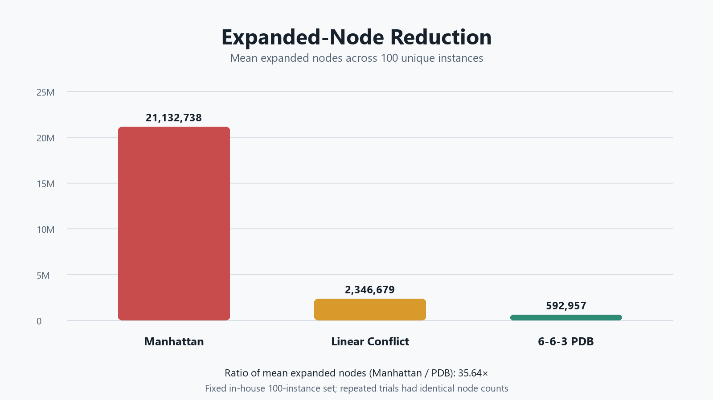
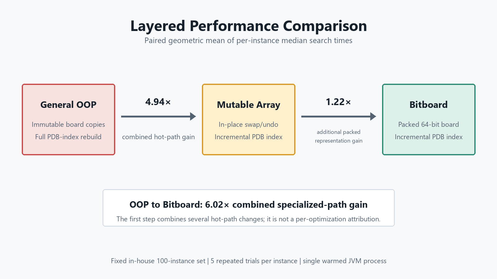

# High-Performance N-Puzzle Solver


[](https://github.com/Zephyr-edu-cn/npuzzle-solver/actions/workflows/maven-ci.yml)


A Java IDA* solver for the canonical 15-Puzzle. The project studies performance at two levels: stronger admissible heuristics reduce search effort, while specialized state updates reduce per-node overhead.

<p align="center">
  
</p>

## Results at a Glance

- **Search effort:** the additive 6-6-3 PDB reduces mean expanded nodes from `21,132,738` to `592,957`, a **35.64x** ratio relative to Manhattan on the fixed repository dataset.
- **Hot-path specialization:** PDB OOP to Mutable Array yields a **4.944x** paired geometric-mean speedup; Mutable Array to Bitboard adds **1.218x** under the matched incremental algorithm.
- **Validation evidence:** all 2,500 runs under the current benchmark protocol completed successfully; across all 500 trial-instance groups, the five configurations agreed on solution depth, and the three PDB paths also agreed on generated and expanded node counts.

The recorded benchmark evidence is in [`benchmark_results/Search_results_v2.csv`](benchmark_results/Search_results_v2.csv). Methodology and evidence boundaries are documented in [`docs/benchmark.md`](docs/benchmark.md) and [`docs/correctness.md`](docs/correctness.md).

## Core Design

### Search and heuristics

- IDA* advances its threshold to the minimum `f = g + h` value that exceeded the previous bound.
- Heuristics include Manhattan Distance, LIS-based Linear Conflict, and an additive 6-6-3 Disjoint Pattern Database.
- PDB generation uses reverse 0/1-cost search: moving a pattern tile costs 1; moving a non-pattern tile costs 0.
- Immediate reversals are pruned without a global closed set, retaining IDA*'s low-memory design.

### State and update paths

| Path | Board update | PDB index update |
|---|---|---|
| OOP | Immutable `PuzzleBoard` objects | Rebuilt from the board |
| Mutable Array | In-place `int[]` swap/backtrack | Incremental |
| Bitboard | Packed 64-bit transition | Incremental |

The three PDB paths use the same move order, threshold logic, PDB tables, reverse-move pruning, goal semantics, and node counters. Mutable Array is the strong baseline for measuring the additional contribution of packed representation. OOP to Bitboard remains a combined comparison, not a pure Bitboard attribution.

## Macro Benchmark

The benchmark runner uses `datasets/my_benchmark_100.txt` under the following protocol:

- 100 unique solvable instances and 5 measured trials;
- 5 counterbalanced solver configurations;
- 120-second timeout per search;
- `System.nanoTime()` around `search()` inside the worker task;
- per-instance median times followed by paired speedup statistics;
- one warmed JVM process, with PDB loading and task waiting excluded from search time.

| Configuration | Mean of per-instance medians (ms) | Median (ms) | Mean expanded | Mean EBF |
|---|---:|---:|---:|---:|
| IDA* + Manhattan | 2659.761 | 377.087 | 21,132,738 | 1.342 |
| IDA* + Linear Conflict | 1328.253 | 269.930 | 2,346,679 | 1.281 |
| IDA* + PDB (OOP) | 138.628 | 21.863 | 592,957 | 1.233 |
| IDA* + PDB (Mutable Array) | 24.231 | 4.539 | 592,957 | 1.233 |
| IDA* + PDB (Bitboard) | **19.421** | **3.848** | **592,957** | **1.233** |

<p align="center">
  
</p>

Repeated trials produced identical node counts for each configuration and instance. Across all 500 trial-instance groups, the five configurations returned the same solution depth, and the three PDB paths had identical generated and expanded node counts.

### Layered performance comparison

| Comparison | Paired geometric mean | Interpretation |
|---|---:|---|
| PDB OOP to Mutable Array | **4.944x** | Combined in-place and incremental-index gain |
| Mutable Array to Bitboard | **1.218x** | Additional packed-representation gain |
| PDB OOP to Bitboard | **6.023x** | Combined specialized-path gain |

<p align="center">
  
</p>

The first step changes both state management and PDB-index maintenance. It is intentionally reported as a combined hot-path result. The second step is the stronger array-to-packed comparison; it is a paired aggregate and does not imply that Bitboard wins on every individual instance.

## Correctness

- A solved root returns a zero-move path, and DFS compares actual board states rather than treating `h == 0` as the goal test.
- `NPuzzleProblem` validates board dimensions and tile permutations before search; solvability is checked relative to the supplied goal.
- Manhattan and Linear Conflict are goal-relative. The bundled PDB is specific to `[1, 2, ..., 15, 0]` and fails fast for another goal.
- `scripts/replay_solution.py` independently validates every exported move and the final state.
- `LinearConflictExhaustiveTest` checks admissibility and consistency over all 181,440 reachable 8-Puzzle states.

The optimality argument depends on IDA* threshold semantics and admissible heuristics. Replay and cross-implementation agreement are supporting engineering checks, not substitutes for that argument.

## JMH Microbenchmarks

The state-transition benchmark compares `int[]` clone/swap with a packed-long transition over a 1024-state random-walk pool using runtime-dependent indexing and a `Blackhole`.

- Conservative reference: `541,549 / 106,581 = 5.08x` throughput.
- Five-fork GC profile: `706.134 / 107.405 = 6.57x` throughput.
- Allocation profile: about `80 B/op` for clone/swap and near `0 B/op` for the packed transition.

The recorded reference ratios are **5.08x** in the conservative run and **6.57x** in the five-fork GC-profile run. Neither is a 5x claim against the in-place Mutable Array solver; the macro comparison for that question is 1.218x.

The PDB lookup benchmark reports `184 ns/op` for representative `HashMap<Long, Byte>` lookups and `77 ns/op` for direct `byte[]` lookup. It does not model a complete HashMap-backed production PDB or claim measured L1/L2 hit rates.

An early fixed-input transition benchmark reported about 11x and was withdrawn after identifying JIT-artifact risk. The corrected benchmark uses a state pool, runtime indexing, and a `Blackhole`; no assembly-level claim about a specific C2 optimization is made.

## Visualization and Documentation

This repository provides Java-side trace export and replay validation for an external C++/SFML viewer:

- Viewer: https://github.com/BroMikey/Npuzzle-Visulization
- Protocol: [docs/visualization_protocol.md](docs/visualization_protocol.md)

Detailed documentation:

- [Benchmark report](docs/benchmark.md)
- [Correctness validation](docs/correctness.md)
- [Linear Conflict fix record](docs/linear_conflict_fix.md)
- [6-6-3 PDB design](docs/pdb_design.md)
- [References](docs/references.md)

## Build and Reproduction

Prerequisites: JDK 19 or later, Maven 3.x, and Python for replay or figure generation.

Build and test:

```bash
mvn clean package
```

Run the benchmark protocol:

```bash
java -cp target/classes benchmark.SearchBenchmarkRunner
```

Regenerate the README figures from the recorded CSV (requires Pillow):

```bash
python scripts/generate_readme_figures.py
```

Run JMH:

```bash
java -jar target/benchmarks.jar StateTransitionBenchmark
java -jar target/benchmarks.jar PdbLookupBenchmark
```

Regenerate the bundled PDB files:

```bash
java -Xmx2g -cp target/classes npuzzle.solver.database.PatternDatabaseGenerator
```

Replay an exported solution:

```bash
python scripts/replay_solution.py --problem bin/problem.txt --actions bin/solutionAnimation.txt
```

Expected output for the bundled example:

```text
PASS: 46 actions replayed; final board matches the goal state.
```

## Project Scope

This is an engineering study of established search techniques, centered on implementation, optimization, validation, and evidence-based correction. It does not claim a new search algorithm. The recorded macro results come from a fixed, repository-specific 100-instance dataset rather than the official Korf 100 set, and the five trials run in one warmed JVM. Results should be interpreted within that documented environment and protocol.
