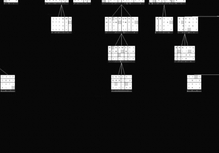

# High-Performance N-Puzzle Solver


A high-performance heuristic search engine for the 15-Puzzle problem. This project investigates performance optimizations across two dimensions: **algorithmic state-space pruning** and **system-level memory management**. All implementations are evaluated under standardized benchmarking methodologies to reduce benchmarking bias and improve empirical reliability.

This project demonstrates that performance gains in combinatorial search problems stem from a combination of **search space reduction (algorithm design)** and **constant-factor optimization (system implementation)**.

## Key Optimizations

### 1. Algorithmic Optimizations: State Space Pruning
- **Heuristic Comparison**: Implemented Manhattan Distance, Linear Conflict, and Disjoint Pattern Databases (PDB).
- **6-6-3 Pattern Database**: Constructed a statically pre-computed 6-6-3 PDB using a reverse Breadth-First Search (BFS) to compute exact minimal costs.
- **EBF Reduction**: The PDB heuristic reduces the Effective Branching Factor (EBF) from `1.341` (Manhattan) to `1.233`, decreasing the average number of expanded nodes by approximately **35.6x** on hard instances.

### 2. System-Level Optimizations: Hardware-Sympathetic Engineering
- **64-bit Bitboard Compression**: Encoded the 4x4 board state into a single 64-bit `long` primitive. 
- **Near-Zero Heap Allocation in the State-Transition Hot Path**: Redesigned the state-transition path to use bitwise operations (masks and shifts) instead of per-move board-array cloning. In the JMH state-transition benchmark and GC profile, the bitboard path reports near-zero heap allocation, while the traditional array clone/swap path reports measurable allocation pressure.
- **Cache Locality**: Flattened the high-dimensional PDB into a 1D `byte[]` array, avoiding the autoboxing and hashing overhead of `HashMap<Long, Byte>` to improve CPU L1/L2 cache hit rates.

---

## Benchmarking & Evaluation

To ensure the empirical validity of the performance measurements, the evaluation framework implements the following methodological safeguards:
1. **Global JIT Warmup**: Pre-executing all configurations to trigger JVM C2 compilation prior to measurement.
2. **Common Solved-Set Evaluation**: Time statistics (Mean Time and StdDev) are calculated *strictly on the intersection set* of instances solved by all configurations within the timeout limit.
3. **State Pool Randomization**: JMH benchmarks utilize a 1024-state Random Walk pool to reduce constant folding, dead-code elimination, and cache-locality artifacts.

### Macro-Level: Search Performance (100 Instances)
*Raw CSV contains 3 trials. The formal summary averages Trial 2 and Trial 3 with a 60-second strict timeout per instance.*

| Configuration | Success Rate | Mean Time (ms) | StdDev (ms) | Mean Expanded Nodes | Mean EBF |
| :--- | :--- | :--- | :--- | :--- | :--- |
| **IDA* + Manhattan** | 100.00% | 2375.8 | ±5511.7 | 21,132,738 | 1.341 |
| **IDA* + Linear Conflict**| 100.00% | 1249.0 | ±2202.2 | 2,346,679 | 1.281 |
| **IDA* + PDB (OOP)** | 100.00% | 121.0 | ±243.7 | 592,957 | 1.233 |
| **IDA* + PDB (Bitboard)** | 100.00% | **20.1** | **±39.6** | **592,957** | **1.233** |

> **Key Insight:**  
> Algorithmic improvements (PDB) reduce the search space (~35.6x fewer nodes), while system-level optimizations (Bitboard) reduce per-node execution cost without changing the search tree. Across benchmark runs, state transition is reported as a stable **5x-plus** throughput advantage; in this macro run, the PDB Bitboard configuration also reduced end-to-end mean time from 121.0ms to 20.1ms.

*(Visualization of the Ablation Study, EBF, and State Space)*
<p align="center">
  
  
  
</p>

### Micro-Level: Throughput (JMH Micro-benchmarks)
*Measured via Java Microbenchmark Harness (JMH) on fundamental operations.*

- **State Transition Throughput**: 
  - Object-Oriented (`int[]` clone): `106,581 ops/ms`
  - Bitboard (64-bit bitwise): `541,549 ops/ms` **(5.08x Speedup)**
  - Interpretation: stable **5x-plus** throughput advantage.
  - 5-fork GC profile: `706.134 ops/us` vs. `107.405 ops/us` **(6.57x)**, with near-zero heap allocation in the bitboard state-transition path and `80 B/op` for the array path.
- **Heuristic Lookup Latency**:
  - `HashMap<Long, Byte>`: `184 ns/op`
  - 1D `byte[]` Array: `77 ns/op` **(2.38x Speedup)**

<p align="center">
  
</p>

#### Benchmark Methodology Note (Self-Correction)

An initial ~11x speedup was later treated as a likely fixed-input / JIT benchmark artifact risk. The original microbenchmark used overly stable inputs and could be affected by constant folding, dead-code elimination, or cache-locality artifacts; however, this was not verified with assembly-level or perf-level evidence.

To reduce this risk, the benchmark was redesigned using randomized state inputs with runtime-dependent indexing. This makes the benchmark less dependent on fixed inputs and helps ensure that the state-transition logic is actually executed.

Under these corrected conditions, the reference speedup is ~5.08x.
A later 5-fork GC profile measured ~6.57x with near-zero heap allocation in the bitboard state-transition path.
To avoid mixing benchmark levels and best-case values, this repository reports the state-transition improvement as a stable 5x-plus throughput advantage.

---

Detailed reports:

- [Benchmark Report](docs/benchmark.md)
- [Correctness Validation](docs/correctness.md)
- [Linear Conflict Fix Record](docs/linear_conflict_fix.md)
- [6-6-3 PDB Design](docs/pdb_design.md)
- [Visualization Protocol](docs/visualization_protocol.md)

---

## Search Visualization Pipeline (Java + C++)

To complement quantitative benchmarking, this project includes a cross-language visualization pipeline for qualitative analysis of search behavior.

This repository mainly provides the Java-side trace export and replay validation. The C++ / SFML viewer is an external visualization frontend used to inspect exported trajectories.

- **Backend (Java)**:
  - The IDA* solver serializes DFS search trajectories into a compact state sequence format.
  - Custom encoding avoids object overhead and enables efficient streaming of large search traces.

- **Frontend (C++ / SFML)**:
  - Visualization engine: https://github.com/BroMikey/Npuzzle-Visulization
  - Parses serialized sequences via a custom protocol and reconstructs the search process for rendering.
  - Hardware-accelerated rendering enables smooth playback of large search traces.

This pipeline enables:
- Inspection of search trajectories and solution paths
- Visualization of heuristic guidance behavior
- Debugging and validation of search correctness

<p align="center">
  
</p>

---

## Build & Reproducibility

### Prerequisites
- JDK 19 or higher
- Apache Maven 3.x

### Execution Guide

The `6-6-3 Disjoint Pattern Database (.dat)` files are already included in `src/main/resources/` for immediate out-of-the-box reproducibility.

1. **Compile the project and build the JMH Uber-JAR:**
   ```bash
   mvn clean package
   ```

2. **Run JMH Micro-benchmarks (Micro-Level):**
   ```bash
   java -jar target/benchmarks.jar StateTransitionBenchmark
   java -jar target/benchmarks.jar PdbLookupBenchmark
   ```

3. **Run Macro Benchmark (Search Evaluation):**
   ```bash
   java -cp "target/classes;target/benchmarks.jar" benchmark.SearchBenchmarkRunner
   ```
   *(Note for Unix/Linux/Mac users: Replace the semicolon `;` with a colon `:` in the classpath.)*

### Replay exported solution

After running the Java solver, validate the exported solution path:

```bash
python scripts/replay_solution.py --problem bin/problem.txt --actions bin/solutionAnimation.txt --write-trace examples/latest_validated_trace.txt
```

Expected output:

```text
PASS: 52 actions replayed; final board matches the goal state.
```
---
## Conclusion
This project demonstrates that combining heuristic design (to reduce search space) with hardware-aware implementation (to reduce constant factors) leads to multiplicative performance gains in combinatorial search problems.
