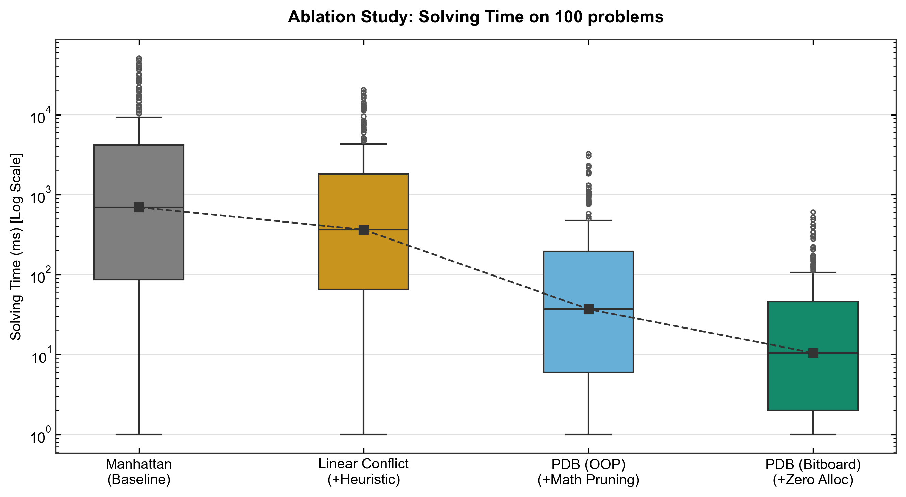
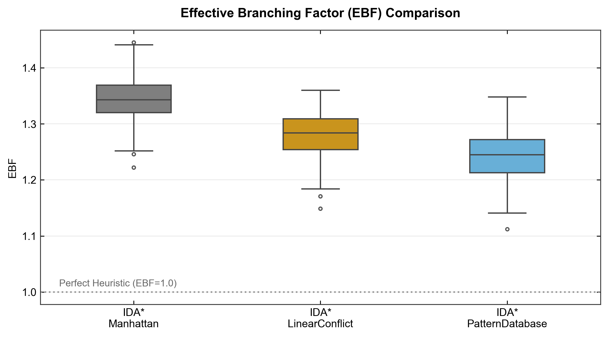
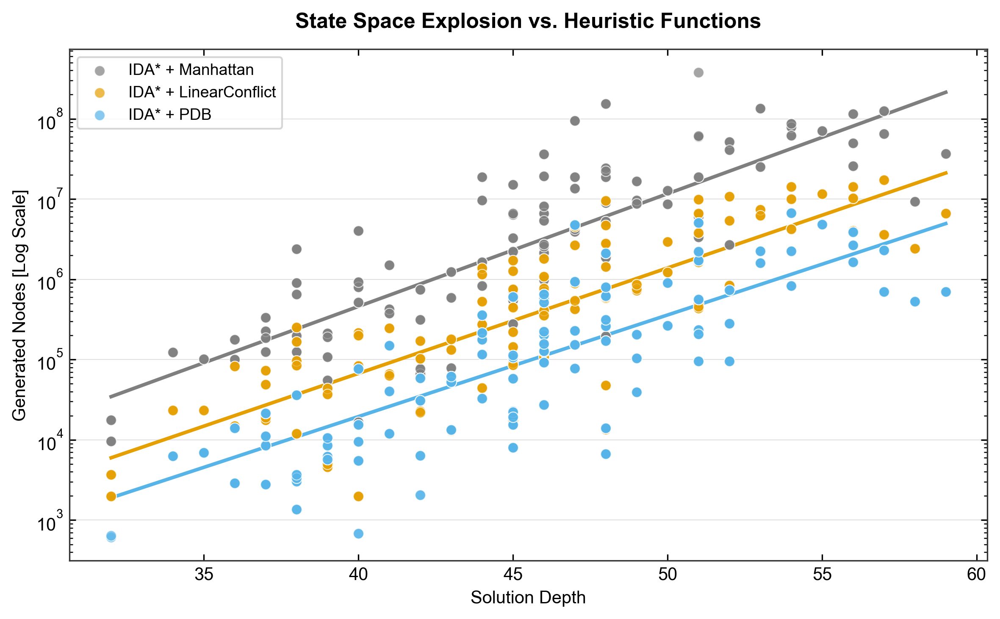
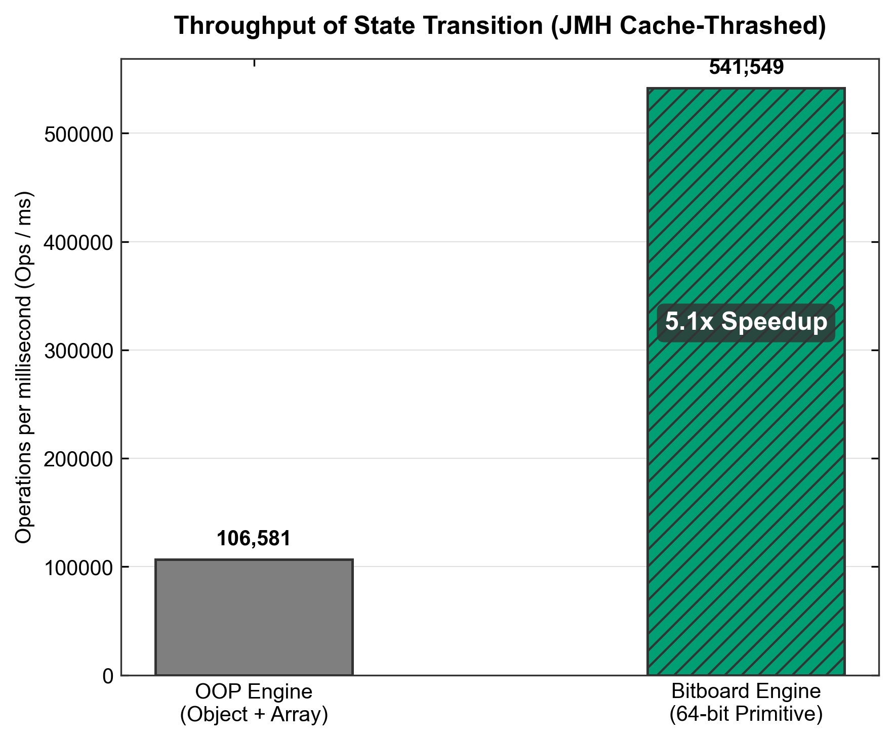

# High-Performance N-Puzzle Solver


A high-performance heuristic search engine for the 15-Puzzle problem. This project investigates performance optimizations across two dimensions: **algorithmic state-space pruning** and **system-level memory management**. All implementations are evaluated under standardized benchmarking methodologies to ensure statistically unbiased comparisons.

This project demonstrates that performance gains in combinatorial search problems stem from a combination of **search space reduction (algorithm design)** and **constant-factor optimization (system implementation)**.

## Key Optimizations

### 1. Algorithmic Optimizations: State Space Pruning
- **Heuristic Comparison**: Implemented Manhattan Distance, Linear Conflict, and Disjoint Pattern Databases (PDB).
- **6-6-3 Pattern Database**: Constructed a statically pre-computed 6-6-3 PDB using a reverse 0-1 Breadth-First Search (BFS) to compute exact minimal costs.
- **EBF Reduction**: The PDB heuristic reduces the Effective Branching Factor (EBF) from `1.341` (Manhattan) to `1.233`, decreasing the average number of expanded nodes by approximately **30x** on hard instances.

### 2. System-Level Optimizations: Hardware-Sympathetic Engineering
- **64-bit Bitboard Compression**: Encoded the 4x4 board state into a single 64-bit `long` primitive. 
- **Zero-Allocation State Transitions**: Redesigned the IDA* search loop to execute state transitions via bitwise operations (masks and shifts). This eliminates object instantiation (`new int[]` or `new Node()`), resulting in zero Young Generation Garbage Collection (GC) overhead during deep DFS traversals.
- **Cache Locality**: Flattened the high-dimensional PDB into a 1D `byte[]` array, avoiding the autoboxing and hashing overhead of `HashMap<Long, Byte>` to improve CPU L1/L2 cache hit rates.

---

## Benchmarking & Evaluation

To ensure the empirical validity of the performance measurements, the evaluation framework implements the following methodological safeguards:
1. **Global JIT Warmup**: Pre-executing all configurations to trigger JVM C2 compilation prior to measurement.
2. **Survivor Bias Prevention**: Time statistics (Mean Time and StdDev) are calculated *strictly on the intersection set* of instances solved by all configurations within the timeout limit.
3. **State Pool Randomization**: JMH benchmarks utilize a 1024-state Random Walk pool to prevent CPU branch predictor and L1 cache over-optimization.

### Macro-Level: Search Performance (100 Instances)
*Aggregated over 3 trials with a 60-second strict timeout per instance.*

| Configuration | Success Rate | Mean Time (ms) | StdDev (ms) | Mean Expanded Nodes | Mean EBF |
| :--- | :--- | :--- | :--- | :--- | :--- |
| **IDA* + Manhattan** | 99.00% | 5566.3 | ±10044.8 | 17,515,815 | 1.341 |
| **IDA* + Linear Conflict**| 100.00% | 2389.3 | ±4224.2 | 2,069,172 | 1.278 |
| **IDA* + PDB (OOP)** | 100.00% | 256.7 | ±526.7 | 592,956 | 1.233 |
| **IDA* + PDB (Bitboard)** | 100.00% | **47.9** | **±97.6** | **592,956** | **1.233** |

> **Key Insight:**  
> Algorithmic improvements (PDB) reduce the search space (~30x fewer nodes), while system-level optimizations (Bitboard) further reduce physical execution time (~5.3x speedup, from 256.7ms to 47.9ms) by minimizing memory allocation overhead, without changing the search tree structure.

*(Visualization of the Ablation Study, EBF, and State Space)*
<p align="center">
  
  
  
</p>

### Micro-Level: Throughput (JMH Micro-benchmarks)
*Measured via Java Microbenchmark Harness (JMH) on fundamental operations.*

- **State Transition Throughput**: 
  - Object-Oriented (`int[]` clone): `106,581 ops/ms`
  - Bitboard (64-bit bitwise): `541,549 ops/ms` **(5.08x Speedup)**
- **Heuristic Lookup Latency**:
  - `HashMap<Long, Byte>`: `184 ns/op`
  - 1D `byte[]` Array: `77 ns/op` **(2.38x Speedup)**

<p align="center">
  
</p>

#### Benchmark Methodology Note (Self-Correction)

An initial ~11x speedup was later identified as a benchmarking artifact caused by JVM JIT optimizations (e.g., constant folding and dead code elimination), which partially removed the baseline workload.

To correct this, the benchmark was redesigned using randomized state inputs with runtime-dependent indexing. This prevents over-optimization and ensures full execution of the state transition logic.

Under these corrected conditions, the measured speedup stabilizes at ~5.08x, which more accurately reflects real-world performance.

---

## Build & Reproducibility

### Prerequisites
- JDK 19 or higher
- Apache Maven 3.x

### Execution Guide

1. **Compile the project and build the JMH Uber-JAR:**
   ```bash
   mvn clean package
   ```

2. **Run JMH Micro-benchmarks (Micro-Level):**
   ```bash
   java -jar target/benchmarks.jar StateTransitionBenchmark
   java -jar target/benchmarks.jar PdbLookupBenchmark
   ```

3. **Run Macro Benchmark (Search Evaluation):**
   ```bash
   java -cp target/benchmarks.jar benchmark.SearchBenchmarkRunner
   ```
   *(Note for Unix/Linux/Mac users: Replace the semicolon `;` with a colon `:` in the classpath.)*

---
## Conclusion
This project demonstrates that combining heuristic design (to reduce search space) with hardware-aware implementation (to reduce constant factors) leads to multiplicative performance gains in combinatorial search problems.